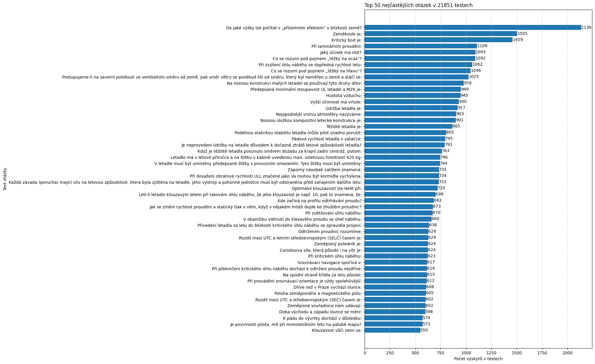
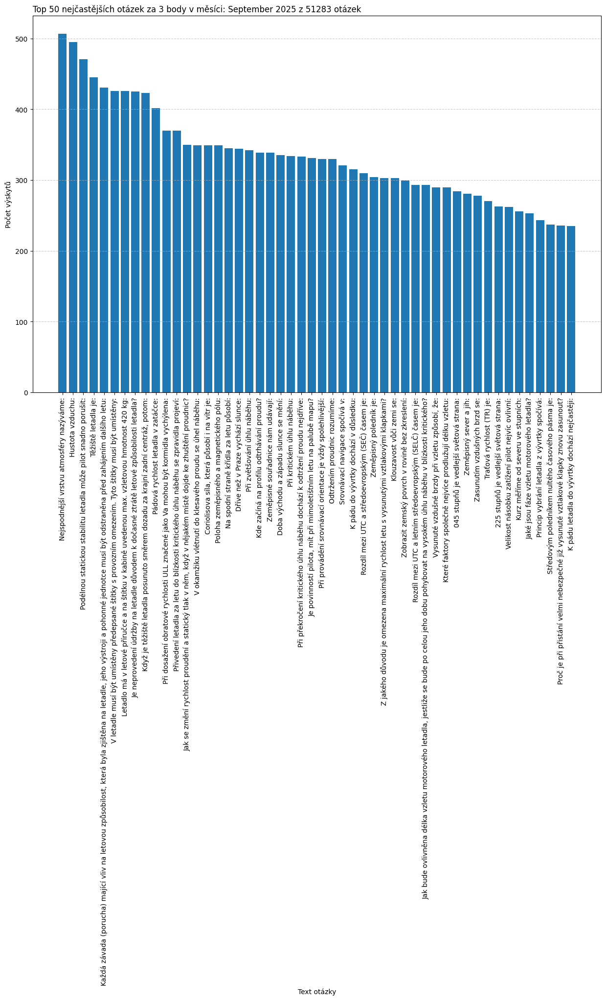

# Analýza otázek z testů

__POCHOPITELNĚ NENÍ TOTO OFICIÁLNÍ STATISTIKA KTERÉ BY SE JAKKOLIV DALA ZNEUŽÍT K ZJEDNDODUŠENÍ NEBO ZKRESLENÍ VÝSLEDKŮ TESTŮ, BERTE TO JAKO INFROMATIVNÍ STATISTIKU!__

Data jsou z testů vykonaných v datech: **2025-04-15_to_2025-09-05**
Celkem bylo zpracováno **4755** testů.
které obsahovaly dohromady **198694** otázek.
Jedinečných otázek je **998**.
Počet otázek, které se vyskytly u kterých není jasno za kolik jsou bodů: **19**.

## nejčastější otázky celkově:

## Seznam nejčastějších otázek z nejnovějšího týdne:

## Seznam nejčastějších otázek z nejnovějšího Měsíce:

## Seznam nječastějších otázek za 3 body z nejnovějšího Měsíce:

## Seznam nejčastějších otázek z posledních 30 dní:

