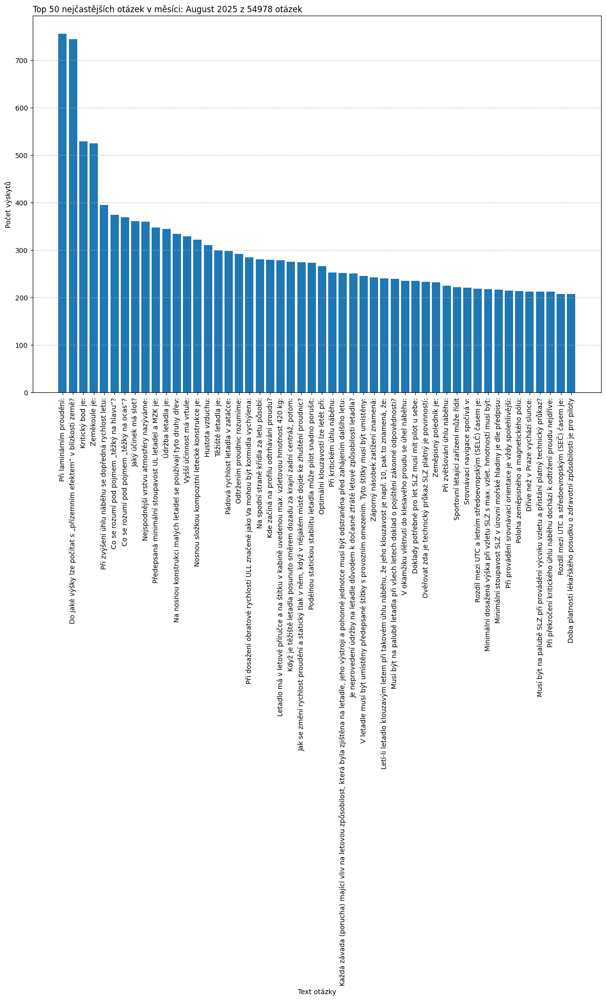
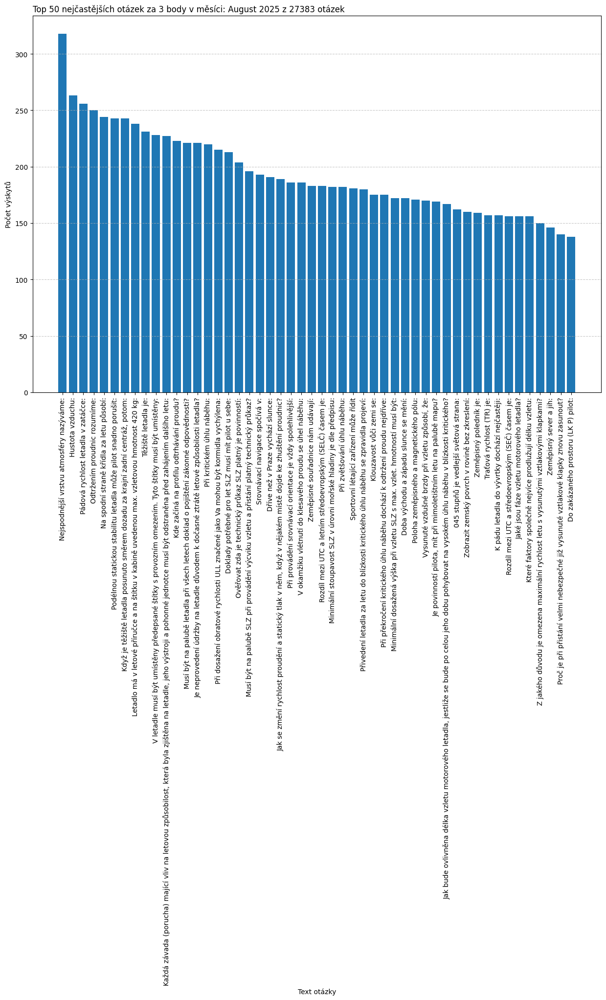

# Analýza četnosti otázek v testech

> [!WARNING]
> **Upozornění:** Tato analýza je čistě informativní a je vytvořena z veřejně dostupných dat. V žádném případě neslouží jako oficiální statistika a neměla by být zneužita k jakémukoliv ovlivňování či zkreslování výsledků reálných testů.

---

## Souhrnné statistiky

*   **Analyzované období:** 2025-04-15_to_2025-08-20
*   **Celkový počet zpracovaných testů:** 14861
*   **Celkový počet otázek v datech:** 364392
*   **Počet unikátních otázek:** 565
*   **Počet unikátních otázek s neznámým počtem bodů:** 0

---

## Top 50 nejčastějších otázek (celkově)
Graf ukazuje 50 otázek, které se nejčastěji vyskytovaly napříč všemi zpracovanými testy.

## Top 50 nejčastějších otázek (poslední celý týden)
Četnost otázek v posledním týdnu, pro který byla nalezena data.

## Top 50 nejčastějších otázek (poslední měsíc)
Četnost otázek v posledním měsíci, pro který byla nalezena data.

## Top 50 nejčastějších otázek za 3 body (poslední měsíc)
Stejná analýza jako výše, ale aplikovaná pouze na otázky s bodovým hodnocením 3.

## Top 50 nejčastějších otázek (posledních 30 dní)
Graf ukazuje četnost otázek v plovoucím okně posledních 30 dní od data generování reportu.

## Porovnání četnosti Top 20 otázek (poslední 4 měsíce)
Tento graf ukazuje vývoj četnosti 20 nejčastějších otázek z posledního měsíce v čase. Umožňuje sledovat, zda se některé otázky stávají více či méně frekventované.

Všechny otázky jsou v [souboru](All_questions.md)
