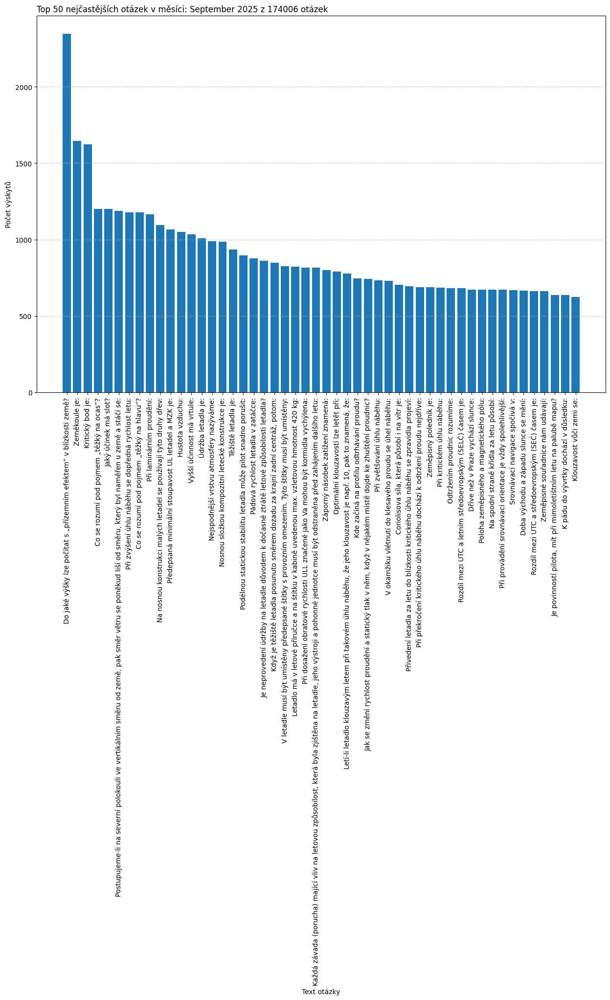

# Analýza otázek z testů
Data jsou z testů vykonaných v datech: **2025-04-15_to_2025-09-05**
Celkem bylo zpracováno **4473** testů.
které obsahovaly dohromady **173336** otázek.
Jedinečných otázek je **977**.

## Seznam nejčastějších otázek z nejnovějšího týdne:

## Seznam nejčastějších otázek z nejnovějšího Měsíce:

