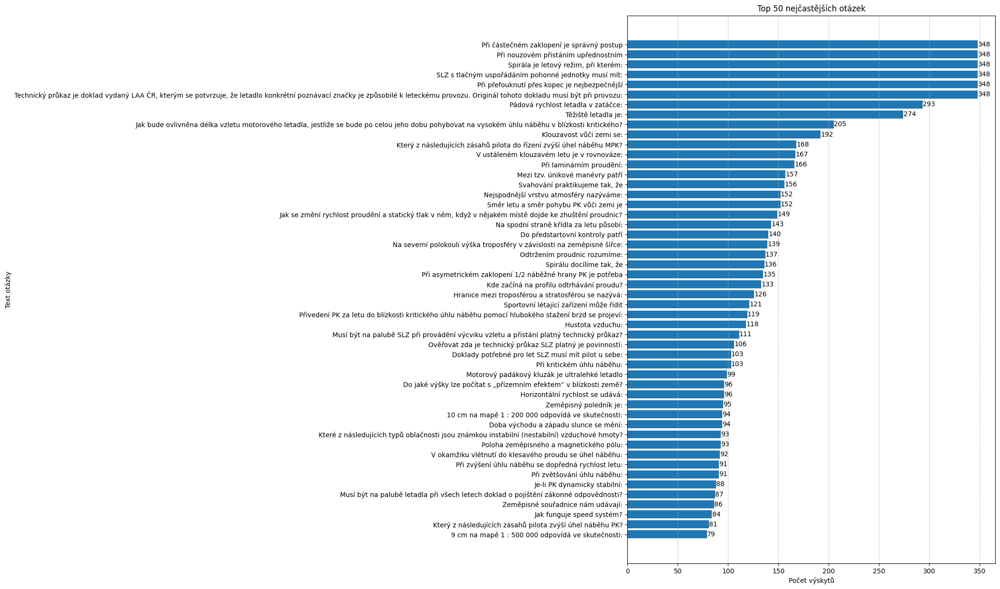

# Test Question Frequency Analysis: MPK instruktor
> [!WARNING]
> **Disclaimer:** This analysis is for informational purposes only...
---
## Summary Statistics
*   **Analyzed Period:** 2025-04-07 to 2025-11-17
*   **Total Unique Tests in Data:** 184
*   **Total Questions in Data:** 10304
*   **Number of Unique Questions:** 408
---
## Top 50 Most Frequent Questions

*All questions for this category are available in the [QUESTIONS.md](QUESTIONS.md) file.*
