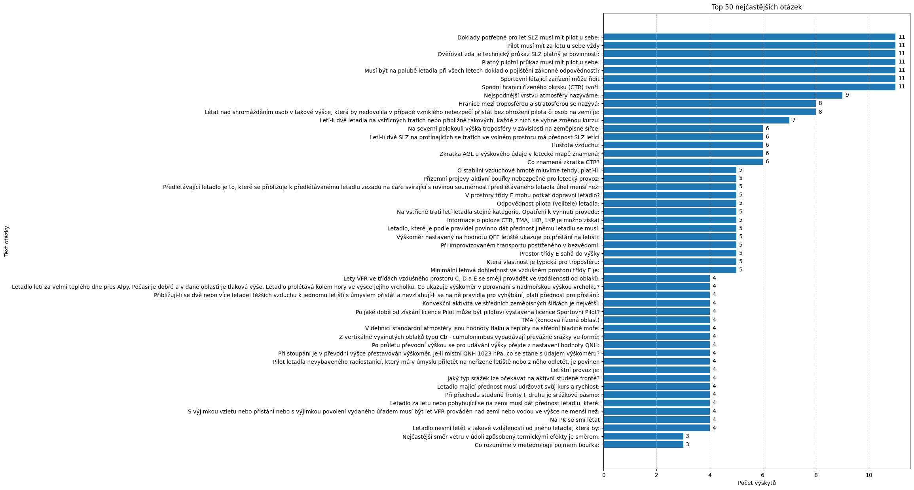

# Test Question Frequency Analysis: PL vlekař
> [!WARNING]
> **Disclaimer:** This analysis is for informational purposes only...
---
## Summary Statistics
*   **Analyzed Period:** 2025-04-07 to 2025-05-24
*   **Total Unique Tests in Data:** 6
*   **Total Questions in Data:** 240
*   **Number of Unique Questions:** 106
---
## Top 50 Most Frequent Questions

*All questions for this category are available in the [QUESTIONS.md](QUESTIONS.md) file.*
