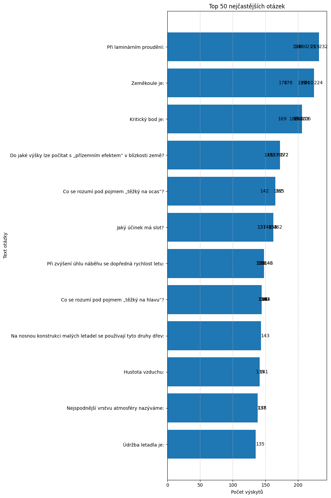

# Test Question Frequency Analysis: ULL Instruktor
> [!WARNING]
> **Disclaimer:** This analysis is for informational purposes only...
---
## Summary Statistics
*   **Analyzed Period:** 2025-04-07 to 2025-11-16
*   **Total Unique Tests in Data:** 142
*   **Total Questions in Data:** 11928
*   **Number of Unique Questions:** 629
---
## Top 50 Most Frequent Questions

*All questions for this category are available in the [QUESTIONS.md](QUESTIONS.md) file.*
